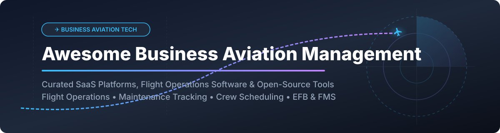

# ✈️ Awesome Business Aviation Management 🛩️

  

  
  
  
  

## 📌 Top Business Aviation Management Ecosystem 🌐

**Curated List of SaaS Platforms & Open-Source GitHub Projects for Flight Operations, Maintenance Tracking, Flight Planning & Crew Scheduling** 🛠️✈️

*Last updated: September 2026*

---

### 🔍 Overview & Ecosystem Analysis

This repository tracks top-tier **SaaS platforms** and **open-source projects** tailored for **Business Aviation Management**. These systems manage complex flight operations, aircraft maintenance tracking, crew scheduling, rostering, compliance, and dispatch for charter operators (FAA Part 135 / EASA Part-NCC), corporate flight departments (Part 91), fractional ownership programs, and private aviation providers.

#### 📊 Market Size & Industry Concentration
The global **Aviation Management & Flight Operations Software Sector** is valued at approximately **$12.4 Billion USD** (2026) and is projected to reach **$24.5 Billion USD by 2034**, growing at a CAGR of **7.8%**. The sector exhibits a **highly concentrated market structure** dominated by major aviation software conglomerates and enterprise aerospace leaders (e.g., Thoma Bravo / ForeFlight, Hearst / CAMP Systems, Veryon, and Portside), while specialized niche operators (such as FL3XX, Leon Software, and FlightCircle) serve specific market sub-segments.

---

## 📑 Table of Contents
- [🏢 SaaS/Hosted Platforms](#-saashosted-platforms)
- [🔓 Open-Source GitHub Projects](#-open-source-github-projects)
- [🤝 How to Contribute](#-how-to-contribute)
- [⚠️ Disclaimer](#%EF%B8%8F-disclaimer)
- [💖 Support & Sponsorship](#-support--sponsorship)
- [📈 Star History](#-star-history)

---

## 🏢 SaaS/Hosted Platforms

| Platform | Description | Estimated Size (Revenue / Valuation) | Pricing Tier (Starting) | Free Tier / Trial Limit |
| :--- | :--- | :--- | :--- | :--- |
| **[ForeFlight Dispatch](https://www.foreflight.com/)** 🚀 | Enterprise flight planning, dispatch, and jet performance management integrated with Boeing/Thoma Bravo's digital ecosystem. | **~$10.55B** (Acquired via DAS Portfolio) | **$260/year** ($21.67/mo per pilot baseline) | **30-day free trial** (via ForeFlight Mobile app) |
| **[Veryon Tracking+](https://veryon.com/)** 🛠️ | Aviation maintenance tracking, publication management, and compliance platform for business aviation and GA operators. | **~$350M** Revenue | **$150/month** (Base starter tier for maintenance tracking) | **14-day free demo trial** upon sales request |
| **[CAMP Systems](https://www.campsystems.com/)** 🛩️ | Enterprise aircraft maintenance tracking, engine health monitoring, and inventory management for corporate jets. | **~$736M** Valuation (~$200M Revenue) | **$120/month** (per aircraft baseline tracking) | **14-day evaluation demo** for flight departments |
| **[FlightBridge](https://www.flightbridge.com/)** 🌉 | Trip management and booking platform connecting business aviation operators with FBOs, car rentals, and catering brokers. | **~$7.5M** Revenue (CAMP Systems Subsidiary) | **$49/month** (Operator Connect package) | **Free forever plan** available for FBO baseline users |
| **[Leon Software](https://www.leonsoftware.com/)** 🗓️ | Cloud-based flight operations and crew management system for charter operators, covering rostering and dispatch. | **~$18M** Valuation (~$5.3M Revenue) | **€99/month** (per aircraft for BASIC plan) | **30-day free trial** (No credit card required) |
| **[FL3XX](https://www.fl3xx.com/)** ⚡ | Comprehensive web-driven aviation management platform covering flight ops, crew scheduling, maintenance, and billing. | **~$3.3M** Revenue | **€150/month** (Starter module per aircraft) | **14-day full access demo** upon sales onboarding |
| **[Avianis](https://www.avianis.com/)** 💼 | Cloud business aviation management platform with scheduling, maintenance tracking, and CRM (Portside Ecosystem). | **~$25M** Revenue (Portside Ecosystem) | **$199/month** (Starter flight department plan) | **14-day guided trial** for charter operators |
| **[FlightLogger](https://www.flightlogger.com/)** 🎓 | Flight training & academy management platform with flight scheduling, student tracking, and ATO compliance. | **~$3.0M** Revenue | **€85/month** (Base flight school tier) | **14-day interactive demo** environment |
| **[FlightCircle](https://www.flightcircle.com/)** ⭕ | Online flight school & flying club management software with real-time aircraft scheduling and automated billing. | **~$2.5M** Revenue | **$10/month** (per aircraft, unlimited users) | **60-day free trial** (3 months for EAA members) |

---

## 🔓 Open-Source GitHub Projects

The open-source business aviation ecosystem provides foundational frameworks for flight tracking, EFB (Electronic Flight Bag) navigation, maintenance digitizing, and FMS libraries.

| Repository | GitHub_Stars | Description | Focus Area |
| :--- | :--- | :--- | :--- |
| **[wiedehopf/tar1090](https://github.com/wiedehopf/tar1090)** 🌐 |  | Web interface for ADS-B tracking receivers (`readsb` / `dump1090-fa`) with detailed aircraft trajectories. | Live Air Traffic & ADS-B Tracking |
| **[wiedehopf/readsb](https://github.com/wiedehopf/readsb)** 📡 |  | High-performance C-based ADS-B decoder and data feed aggregator for aviation airspace tracking. | ADS-B Signal Decoding |
| **[Ysurac/FlightAirMap](https://github.com/Ysurac/FlightAirMap)** 🗺️ |  | Open-source web platform to display flight positions on a map using ADS-B, Mode-S, and APRS feeds. | Airspace Visualization & Radar |
| **[wiedehopf/graphs1090](https://github.com/wiedehopf/graphs1090)** 📊 |  | Performance and signal metric graphing suite for ADS-B flight receiver infrastructure. | Flight Station Analytics |
| **[Akaflieg-Freiburg/enroute](https://github.com/Akaflieg-Freiburg/enroute)** 🧭 |  | Open-source Electronic Flight Bag (EFB) and flight navigation app for Android/iOS pilots under VFR. | Pilot EFB & Air Navigation |
| **[iiamit/MyTailLog](https://github.com/iiamit/MyTailLog)** 🤖 |  | AI-powered aircraft logbook digitizer and maintenance tracker for GA owners using LLM vision models. | AI Logbook Digitization & Maintenance |
| **[smartops-aero/smartops-odoo-flight](https://github.com/smartops-aero/smartops-odoo-flight)** 🧮 |  | Modular Odoo 18.0 suite for flight operations, aerodromes, aircraft specs, and crew assignment. | Odoo Aviation ERP & Ops |
| **[efb (LibEFB)](https://docs.rs/efb/0.3.2/efb/)** 🦀 |  | Electronic Flight Bag library in Rust providing Flight Management System (FMS) navigation & ARINC 424 parsing. | Rust FMS & Airway Navigation |
| **[Rusty112358/MSAT](https://github.com/Rusty112358/MSAT)** 💻 |  | USAF Maintenance Scheduling Application Tool for aircraft configuration parsing and maintenance ranking. | Fleet Maintenance Data Mining |
| **[OpenFBO](https://wenku.csdn.net/doc/5cpnbhr3tb)** ⛽ |  | Web-based Fixed Base Operator management platform with scheduling algorithms, fuel POS, and LDAP auth. | FBO Ground Ops & Scheduling |
| **[Anantha1605/SkyTrack](https://github.com/Anantha1605/SkyTrack)** 📋 |  | Aviation DBMS tracking aircraft fleets, passenger bookings, flight schedules, and staff rosters. | Fleet DBMS & Operations |
| **[fp (BAERI Flight Planning)](https://zenodo.org/records/17945169)** 🧪 |  | Research flight planning system with satellite track overlays, coast buffer mapping, and turn time math. | Atmospheric Flight Planning |

---

## 🧰 Custom Stack Architecture

For organizations building independent business aviation software solutions:
- **Flight & Fleet Operations**: Combine **SmartOps Flight** (Odoo-based ERP) with **OpenFBO** for ground operations, fuel management, and calendar scheduling.
- **Maintenance & Compliance**: Integrate **MyTailLog** for AI vision extraction of airframe/engine maintenance logs alongside **MSAT** logic.
- **In-Flight Navigation & Dispatch**: Use **LibEFB** (Rust) for FMS computations and ARINC 424 navigation data alongside **enroute** for pilot EFB views.

---

## 🤝 How to Contribute

Contributions are welcome! Please follow these simple guidelines:
1. Fork this repository.
2. Edit `README.md` keeping the standard tabular format and factual descriptions.
3. Submit a Pull Request detailing your additions or updates.

---

## ⚠️ Disclaimer

- This list is community-curated for informational and research purposes.
- Operational business aviation management systems must strictly adhere to regulatory authority guidelines (FAA Part 91/135, EASA Part-NCC/NCO/145).
- Self-hosted software requires validation and safety certification prior to live flight dispatch usage.

---

## 💖 Support & Sponsorship

Thank you for visiting and using this project! If you find this curated list helpful for your business aviation operations, software engineering, or research, please consider supporting the project:

- 🌟 **Star** this repository on GitHub to help others discover it.
- 🍴 **Fork** it to keep your own copy and contribute additions.
- 📢 **Share** it with fellow aviators, developers, and aviation technologists.
- ☕ **Buy me a coffee / Sponsor**: Support ongoing maintenance and future developments via the [GitHub Sponsor Dashboard](https://github.com/sponsors/ishandutta2007).

---

## 📈 Star History

---

**Made with ❤️ for charter operators, flight departments, flight schools, and aviation software engineers.**
